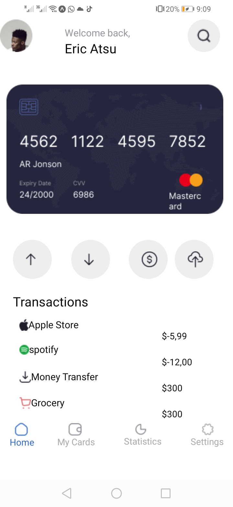
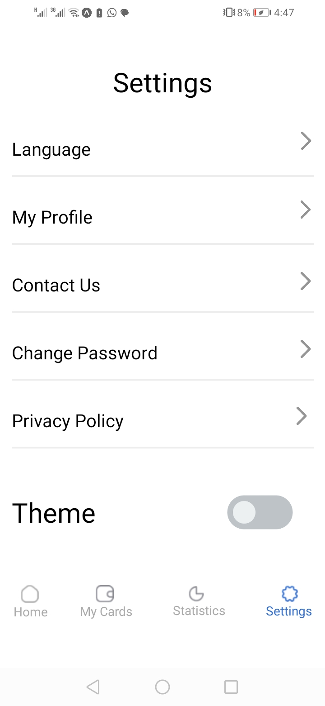

# Main Components

## Homescreen Component

* Displays a welcome message and user profile information.
* Shows a list of recent transactions using a FlatList component.
* Includes navigation buttons at the bottom to switch between different sections of the app (Home, My Cards, Statistics, Settings).

## Settings Component
* Allows users to navigate and update various settings like language, profile information, contact details, password, and privacy policy.
* Includes a theme toggling feature with a button to switch between light and dark modes.

## App Component

* Sets up the navigation structure using react-navigation
* Manages the app's theme state using React's useState and useEffect hooks.
* Provides a context (ThemeContext) to share the theme and toggle functionality across the app.

